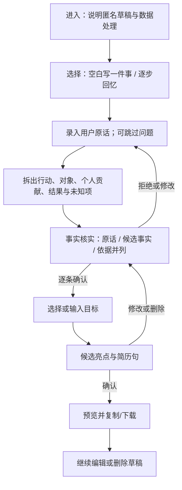

# Day 02｜A 的低保真主流程草图

状态：供 B/C 估算与评审的交互草图，尚无真实用户验证。页面文案、步骤数和字段均可根据访谈与 Contract 调整。

## 关键屏幕与异常分支

| 屏幕 | 用户看得到的内容 | 下一步与退路 |
| --- | --- | --- |
| 起点 | “先写一件事”与“跟着问题想”两个入口，匿名草稿提示 | 自由输入有细节时不强迫做完整向导；随时切换 |
| 回忆 | 一次一个中性问题，显示原话和“跳过/不知道” | 停顿或无经历时给课程、生活、社团等场景提示，但不替用户编事 |
| 核实 | 原话、候选事实、依据和未知标记并列 | 每条确认、编辑或拒绝；结果未知也可继续 |
| 目标 | 可写岗位/申请目标，也可选“暂不确定” | 不根据目标虚构经历或岗位要求 |
| 候选句 | 亮点、候选句、可追溯的已确认事实 | 用户改写或删除；模型失败时用人工模板和手动编辑 |
| 导出 | 与最终预览一致的文本复制和 Markdown 下载 | 导出后仍可返回修改；不要求 P1 知识库 |

## 现场演示路径

用 [虚构演示剧本](day03-demo-script.md) 演示“原话 → 未知项 → 用户确认 → 目标 → 可编辑候选句 → 导出”，以及模型不可用、无数字和团队成果三个异常分支。草图只说明目标体验，不声称当前 Web 已实现这些页面。
